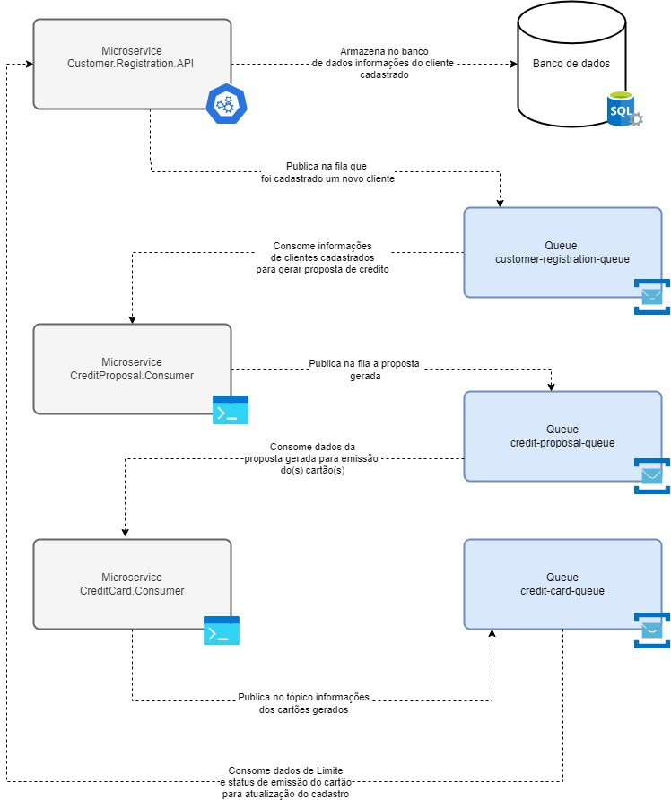

## Visão Geral da Arquitetura

### 1. Microsserviços

Os três serviços são independentes e cada um deles possui seu próprio escopo de responsabilidade. Eles seguem a arquitetura de microsserviços, que é baseada em:

- Autonomia: Cada serviço é independente, com seu próprio ciclo de vida.
- Resiliência: A falha em um serviço não afeta os demais diretamente.
- Escalabilidade: Serviços podem ser escalados individualmente.
  
## Comunicação entre os Microsserviços via Azure Service Bus
### 2. Motivação para Comunicação Assíncrona
A comunicação assíncrona permite que os serviços se comuniquem sem depender da disponibilidade instantânea dos outros. Isso melhora a resiliência e desacopla as operações.

- Desacoplamento: Um serviço pode enviar uma mensagem e continuar sua execução, sem precisar esperar pela resposta.
- Escalabilidade: Como não há bloqueio entre os serviços, cada um pode escalar conforme a necessidade.
- Tolerância a falhas: Se um serviço estiver temporariamente indisponível, as mensagens ficam armazenadas na fila até serem processadas.

## Modo de Comunicação:
### Fila (Queue) – Comunicação 1:1.

Exemplo: Serviço A envia dados de cliente para o Serviço B via uma fila client-processing-queue.
Se o Serviço B estiver indisponível, a mensagem é mantida na fila até ele processá-la.

## Diagrama do fluxo

